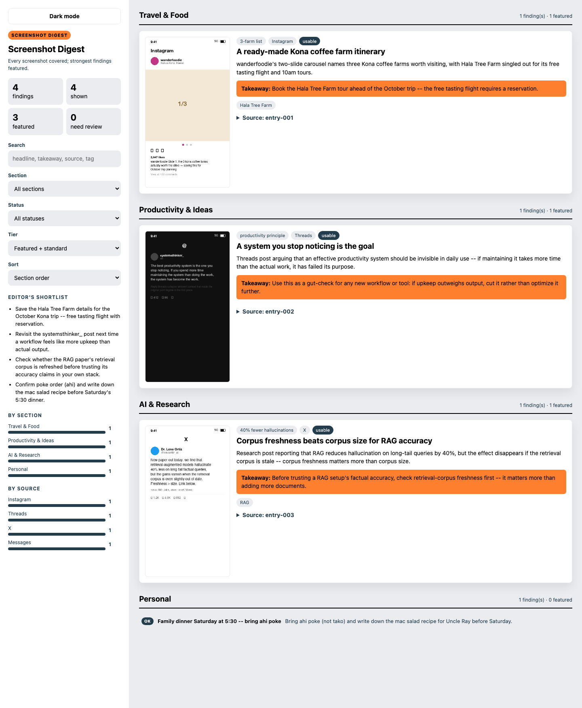

# Screenshot Ingestor (macOS)

A [Claude Code](https://claude.com/claude-code) skill that turns a folder of phone screenshots into a searchable, reviewed archive — extracted text, source/app attribution, confidence-scored summaries, a filterable dashboard, an optional human triage queue, and an optional themed "digest" report with editorial takeaways.

It's a skill, not a standalone binary: an AI agent (Claude Code, or any harness that supports [Agent Skills](https://docs.claude.com/en/docs/claude-code/skills)) reads `SKILL.md` and drives the pipeline, calling out to the small scripts in this repo for the parts that don't need judgment (file inventory, OCR, rendering).

## What the digest looks like

Every screenshot gets covered — nothing is silently dropped — but the strongest finding per section is featured with a takeaway; the rest render as compact rows so a large batch stays scannable. Sidebar search/filter/sort works the same way across all three generated views (dashboard, triage dashboard, digest).



*(Generated from synthetic example screenshots — not real personal data.)*

## Requirements

- macOS, for the on-device Vision OCR path (Apple's `VNRecognizeTextRequest`) and Xcode Command Line Tools (`xcode-select --install`) to compile it on first use.
- Python 3, stdlib only, for the inventory script and both dashboards/digest renderer.
- Optional, for the perceptual-hash grouping and the Tesseract OCR cross-check: `pip install pillow pytesseract` and `brew install tesseract`. Everything degrades gracefully without these — features are feature-detected at runtime and simply skip themselves with a note if the dependency is missing.

## The pipeline

Ask Claude to use this skill against a screenshot folder, and it works through nine steps:

1. **Confirm inputs.** Which folder, optional output location, optional vault/taxonomy path for category matching.
2. **Inventory.** `scripts/inventory_screenshots.py` walks the folder and builds file metadata: dimensions, exact-duplicate hashes, perceptual hashes (dHash, when Pillow is available), and candidate groups — screenshots captured within 20 seconds of each other, plus a separate `phash_only` group for visually similar captures that fell outside that window (e.g. a slow multi-slide scroll).
3. **Extract.** Runs Apple's Vision framework over the screenshots first (`scripts/run_vision_ocr.py` / `scripts/vision_ocr.swift`) as raw OCR evidence, then Claude reads each screenshot directly to interpret it — filtering out UI chrome (status bars, like counts, nav), attributing source app/account, and separating visible text from inferred context. For any screenshot where Vision OCR and Claude's own reading still disagree or look garbled, `scripts/ocr_fallback.py` (Tesseract, with preprocessing variants and PSM sweeps) runs as a third cross-check.
4. **Consolidate.** Screenshots that are really one continuous post/thread/scroll get merged into a single entry, deduplicating overlapping text and keeping every contributing image in `source_images`. A multi-screenshot Instagram carousel becomes one entry, not three.
5. **Review.** A subagent checks the draft extraction against the raw screenshots for OCR mistakes, false merges, missed overlaps, and wrong source guesses, then integrity scores get assigned or revised.
6. **Organize & categorize.** A second subagent labels, tags, and sorts entries by topic/content type, and maps them to a vault/taxonomy if one was provided.
7. **Produce outputs.** JSON + Markdown, plus a scrollable, filterable static HTML dashboard (`scripts/generate_dashboard.py`).
8. **Triage (optional).** `scripts/dashboard.py` serves the same entries from a local server with a persistent Good / Needs OCR redo / Needs manual title / Wrong vault / Merge-or-split queue, so ambiguous entries can be flagged and reprocessed without rerunning the full batch.
9. **Digest (optional).** An editorial synthesis pass over the finished entries — no vision model needed, since it only reads already-extracted text. Every entry gets a finding; a handful of the strongest per section are featured with a headline and takeaway, the rest are compact. For large runs (this is commonly used at ~500 screenshots at a time), the batching is automatic: entries are bucketed by topic/tag into batches of ~40-50, processed one at a time to avoid rate-limit bursts, then reconciled in one final pass that merges same-theme sections and decides tiering across the whole set — not just within a batch.

Confidence is tracked throughout: low-confidence entries get `needs_visual_review: true` and skip having a summary fabricated from garbled text, entries with real OCR/vision disagreement get flagged for the triage queue, and the digest keeps a conservative tone for anything not marked "good."

## Output files

| File | Produced by | What it is |
|---|---|---|
| `screenshot-content-ingest.json` | steps 1-6 | The full structured record — see `references/output-schema.md` |
| `screenshot-content-ingest.md` | step 7 | Human-readable Markdown summary |
| `screenshot-content-ingest.html` | step 7 | Static, filterable dashboard (`generate_dashboard.py`) |
| `screenshot-content-ingest.review.json` | step 8 | Triage decisions sidecar, written by `dashboard.py` |
| `screenshot-content-ingest-digest.html` | step 9 | Themed digest with takeaways (`generate_digest.py`) |

## Repo layout

```
SKILL.md                        instructions the agent follows
scripts/inventory_screenshots.py   file metadata, hashing, candidate grouping
scripts/run_vision_ocr.py       batches scripts/vision_ocr.swift (Apple Vision framework)
scripts/ocr_fallback.py         optional Tesseract cross-check
scripts/generate_dashboard.py   static HTML dashboard renderer
scripts/dashboard.py            local triage server with a persisted review queue
scripts/generate_digest.py      themed digest renderer
references/output-schema.md     JSON schema for every field the pipeline produces
```

## Privacy

Nothing in this repo is wired up to send screenshots or extracted content anywhere beyond the agent session doing the extraction and the local files it writes. The example in this README was generated from synthetic mock screenshots, not real personal data.
